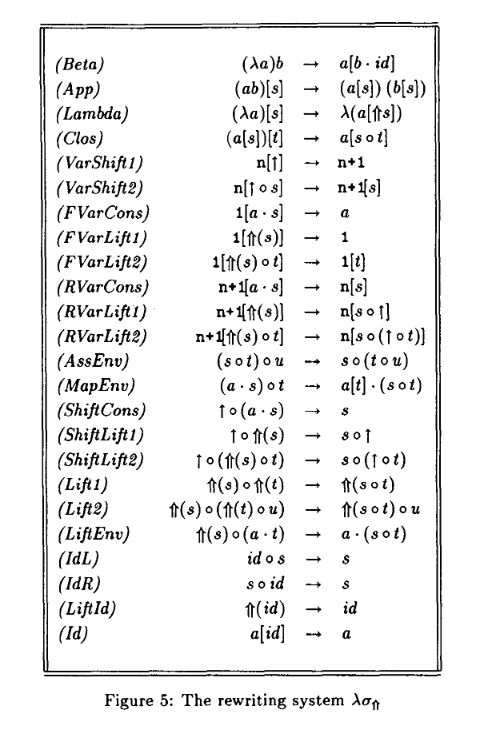

# ghc-tcplugin-api 

This library provides a convenient and cross-compatible interface for authors
of GHC type-checking plugins (starting from GHC 8.8).    

Different stages of a type-checking plugin (initialisation, solving, rewriting, shutdown) are given
different monads to operate within. This ensures operations that only make sense in one context
aren't mistakenly carried out in another.    

To provide a unified interface to these monads (whenever this makes sense), two MTL-style typeclasses
are provided: `MonadTcPlugin` and `MonadTcPluginWork`.    

- `MonadTcPlugin` enables overloading of monadic operations common to all stages,
  such as lifting `IO` operations or performing name resolution.    
  `MonadTcPlugin` is internally implemented using lifting and unlifting of GHC's `TcM` monad,
  but it is hoped that users will not need to access these internals.    

- `MonadTcPluginWork` allows plugins to emit new work (additional constraints for GHC to process),
  including throwing custom type errors. These operations are only available in the solving
  and rewriting stages of a type-checking plugin.    
  Helpers for throwing custom type-errors are also provided, by means of the datatype
  `TcPluginErrorMessage` (which mimics the `ErrorMessage` datakind from `GHC.TypeLits`) and the
  interpreter `mkTcPluginErrorTy`.    

## Discoverability

One goal of this library is to ensure that authors of type-checking plugins should, for the most part,
only need to import this library for their type-checking plugin needs, and not the `ghc` package itself.    
This should assist discoverability: instead of having to trawl through the entire GHC codebase,
new users should be able to determine at a glance what functions might be appropriate for their
usecase using this library's interface. This can be particularly useful when using typed holes.

## Compatibility

This library provides a unified interface that works across different GHC versions (starting from GHC 8.8),
aiming to reduce the CPP burden imposed on authors of type-checking plugins.    

We make use of GHC's new API for rewriting type-families in typechecker plugins,
which was part of GHC 9.4.    
A compatibility layer is provided, which retro-fits the rewriting functionality onto
previous versions of GHC.

## Documentation

The [package documentation](https://hackage.haskell.org/package/ghc-tcplugin-api) includes an overview of type-checking plugins,
and should provide a good starting point for anyone interested in writing a type-checking plugin.

## Examples

A simple example plugin which rewrites type family applications, emitting wanted constraints and
throwing custom type errors as it goes, is provided [here](examples/RewriterPlugin/plugin/RewriterPlugin.hs).    

A more complex example, that of type-checking an intrinsically typed System F, is provided
[here](examples/SystemF/src/SystemF/Plugin.hs). This implements the equational theory of the confluent calculus
of explicit substitutions from the paper [_Confluence properties of weak and strong calculi of explicit substitutions_](https://hal.inria.fr/inria-00077189):

  

